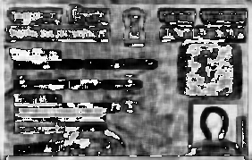
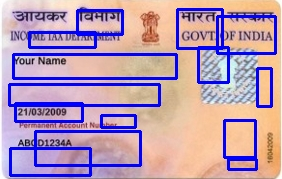

# 🆔 PAN Card Tampering Detection App  

## 📌 Overview  
This **Streamlit-based web app** allows users to compare an **original** and a **tampered** PAN card image to detect modifications using **Structural Similarity Index (SSIM)**. It highlights the differences and provides a similarity score to determine if tampering has occurred.  

## 🚀 Features  
✅ Upload an **original** and a **tampered** PAN card.  
✅ Calculates the **SSIM score** to compare image similarity.  
✅ Highlights **differences** using bounding boxes.  
✅ Displays the **original, tampered, difference map, and thresholded images**.  
✅ Uses **OpenCV & Scikit-Image** for processing.  

---

## 🛠️ Installation  

### 🔹 Prerequisites  
Make sure you have **Python 3.7+** installed.  

### 🔹 Clone the Repository  
Run the following commands to clone the project:  

```bash
git clone https://github.com/yourusername/pan-tampering-detection.git
cd pan-tampering-detection
```

### 🔹 Install Dependencies  
Install the required Python packages using:  

```bash
pip install -r requirements.txt
```

### 🔹 Run the App  
Start the **Streamlit** application by running:  

```bash
streamlit run app.py
```

---

## 📜 Requirements  
This project uses the following dependencies:  

- **`streamlit`** – Web framework for UI  
- **`opencv-python-headless`** – For image processing  
- **`numpy`** – For numerical operations  
- **`scikit-image`** – For computing SSIM  

---

## 🔍 Example Output  

| **Original** | **Tampered** | **Difference Map** | **Highlighted Tampering** |
|-------------|-------------|--------------------|--------------------------|
|  |  |  |  |

---

## 👥 Contributors  

👤 **Lorreta Anyika**  
- **GitHub:** [Lorreta-Anyika](https://github.com/Lorreta-Anyika)  
- **LinkedIn:** [Uchechukwu Lorreta Anyika](https://www.linkedin.com/in/uchechukwu-lorreta-anyika-7b5b4a253/)  

👤 **Boniface Emmanuel**  
- **GitHub:** [bechosen-spec](https://github.com/bechosen-spec)  
- **LinkedIn:** [Emmanuel Boniface](https://www.linkedin.com/in/emmanuel-boniface/)  

---

## 📌 Future Improvements  
🔹 Deploy on **Streamlit Cloud** or **Hugging Face Spaces**.  
🔹 Add **deep learning-based image tampering detection**.  
🔹 Implement a **REST API for automated document verification**.  

---

## 📝 License  
This project is licensed under the **MIT License** – see the [LICENSE](LICENSE) file for details.  

---

💡 *If you find this project useful, don't forget to ⭐ star the repository!* 🚀  

